# Part 2. Python 环境的配置

在这一节中,我将介绍 Python 环境的配置。
如果你的电脑上还没有 Python 并且想要最简单的安装方式，
我建议使用[Anaconda](https://www.anaconda.com/download)，
它包含 Python、NumPy 和许多其他常用的科学计算和数据科学软件包。

现在有两种较为常用的下载软件包的方法，一种是使用pip，另一种则是使用conda。
pip 从 Python 的 PyPI 安装，而 conda 从其自己的渠道（通常是“默认”或“conda-forge”）安装。
PyPI 是迄今为止最大的软件包集合，但是，大多数流行的软件包都可以在 conda 中找到。

## 课程视频

## 通过pip安装

用 pip 管理 Python 环境的常用配置是: `pip` + 虚拟环境 + `requirements.txt`

### 安装pip

在我们默认安装的 Python 中，如果是 Windows 系统，其通常自带 pip 软件包。
我们可以通过命令
```
pip --version
```
来检验 pip 是否安装。如果 pip 在系统中已经安装，则会得到以下结果
```
pip X.X.X from /path/to/site-packages (python X.X)
```
如果 pip 未安装，则可以通过以下命令之一下载`get-pip.py`
```
curl https://bootstrap.pypa.io/get-pip.py -o get-pip.py
wget https://bootstrap.pypa.io/get-pip.py
```
然后运行以下命令安装 pip 
```
python get-pip.py
```
此外，我们可以通过下述命令更新 pip 至最新版本
```
python -m pip install --upgrade pip
```

### 配置虚拟环境

可以通过命令行或者 PyCharm 图形化界面配置虚拟环境。

#### 命令行配置

我们可以运行下述指令创建虚拟环境（通常在项目根目录中）。
```
python -m venv .venv
```
如果想要指定 Python 版本而不是使用默认的 Python 版本， 可以运行下述指令指定。
```
py -x.x -m venv .venv
```
或者
```
/path/to/python -m venv .venv
```
在虚拟环境创建之后，通过下述指令激活虚拟环境。

Windows
```
.venv\Scripts\activate
```
Linux/MacOS
```
source .venv/bin/activate
```

在激活虚拟环境之后，我们就可以通过 pip 等工具管理虚拟环境中的软件包了。
例如，安装 Numpy:
```
pip install numpy
```

#### PyCharm配置

打开 PyCharm ，进入 Settings-Project-Python Interpreter，
点击 add Interpreter 并选择 new Interpreter，选择添加虚拟环境即可。

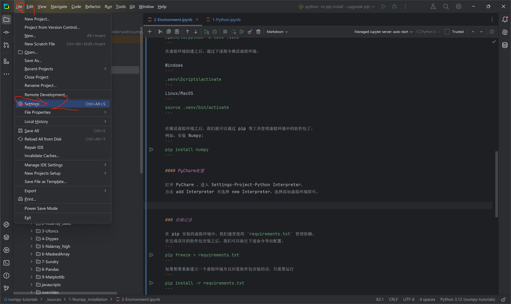
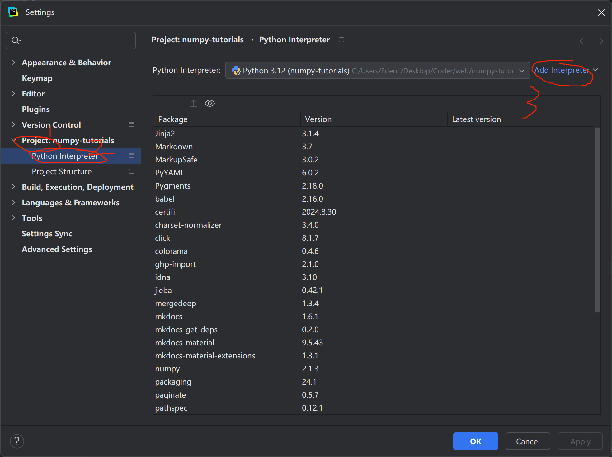
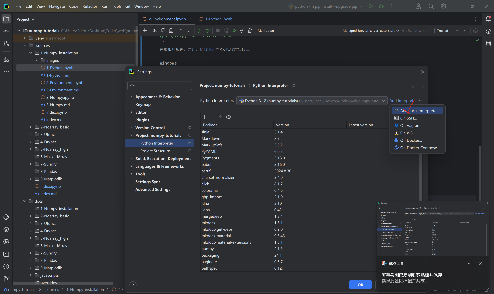
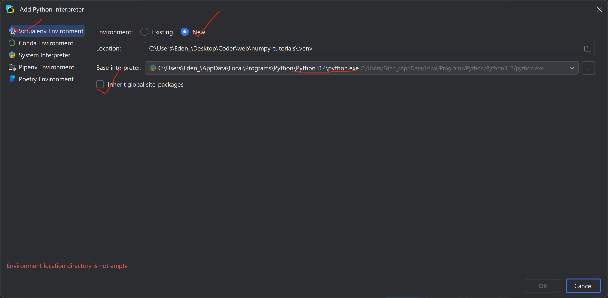
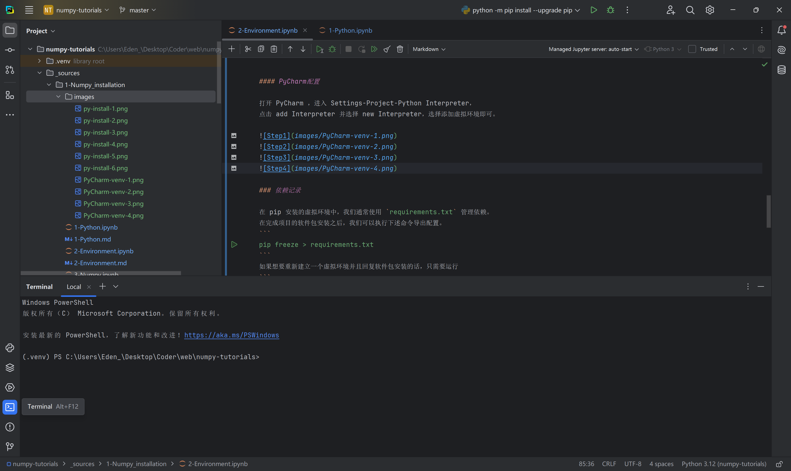

在安装完成之后，PyCharm 自带的 Terminal 中会自动激活该虚拟环境。
如果没有激活，重新启动即可。

### 依赖记录

在 pip 安装的虚拟环境中，我们通常使用 `requirements.txt` 管理依赖。
在完成项目的软件包安装之后，我们可以执行下述命令导出配置。
```
pip freeze > requirements.txt
```
如果想要重新建立一个虚拟环境并且回复软件包安装的话，只需要运行
```
pip install -r requirements.txt
```
就可以了。

## 通过conda安装

用 conda 管理 Python 环境的常用配置是: `conda` + conda环境 + `environment.yaml`

### 安装 Anaconda

点击[这里](https://www.anaconda.com/download/success)跳转 Anaconda 的下载界面。
下载并安装对应系统的 Anaconda ，这里只演示 Windows 系统下的安装。
（除了一个添加路径之外一直点 Yes 就可以了）

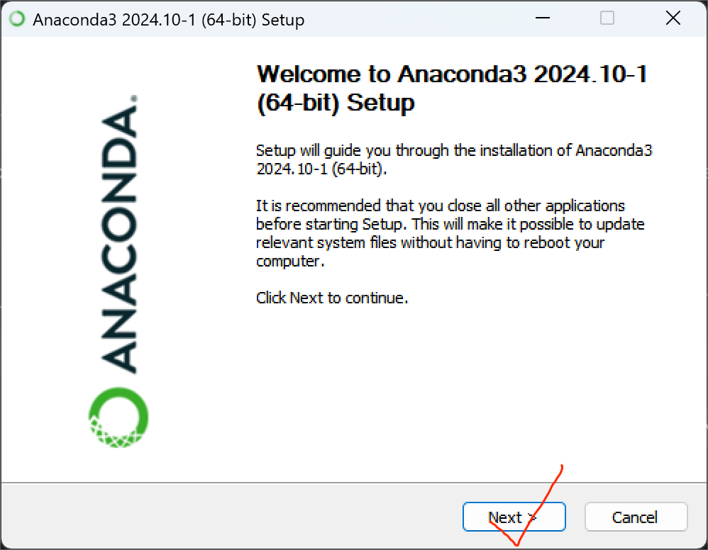
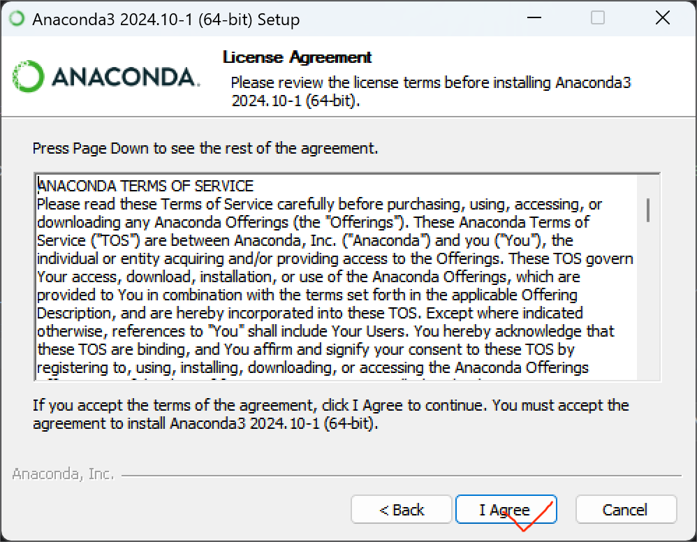
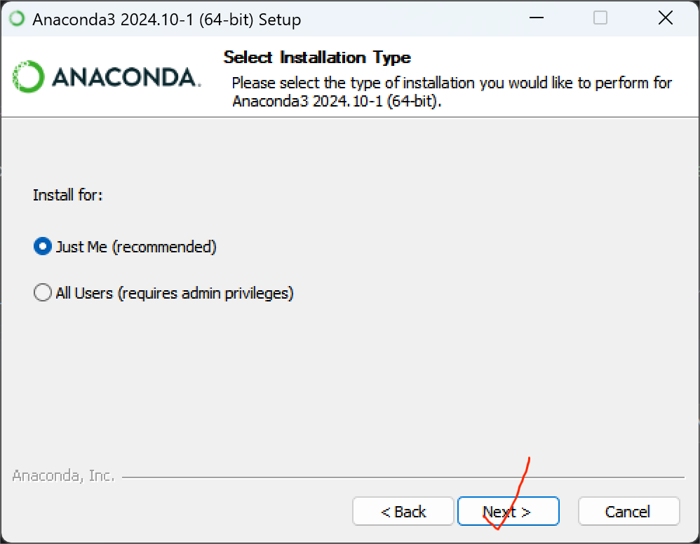
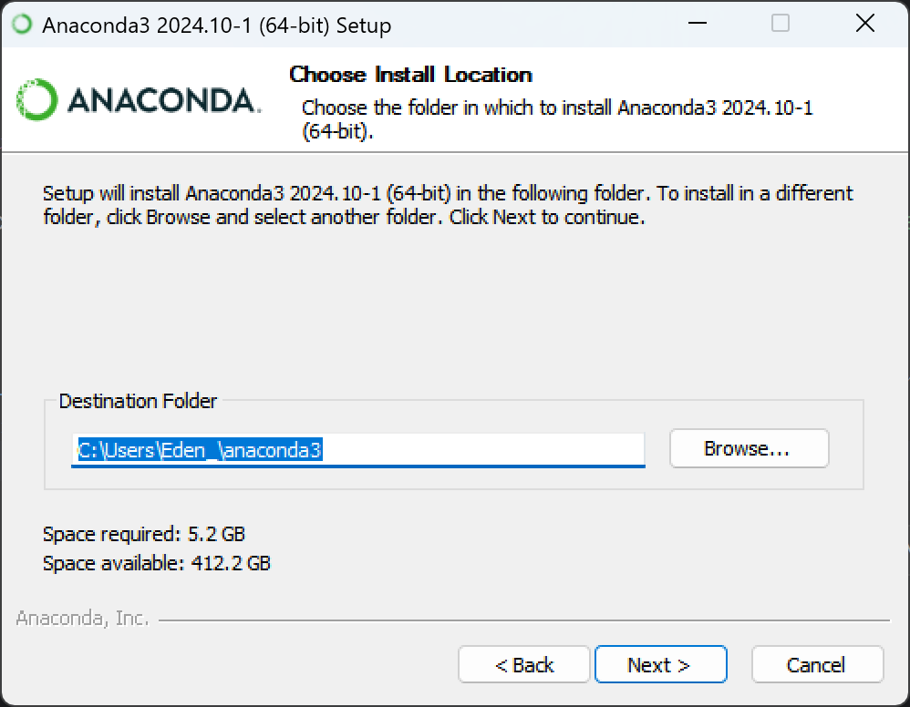
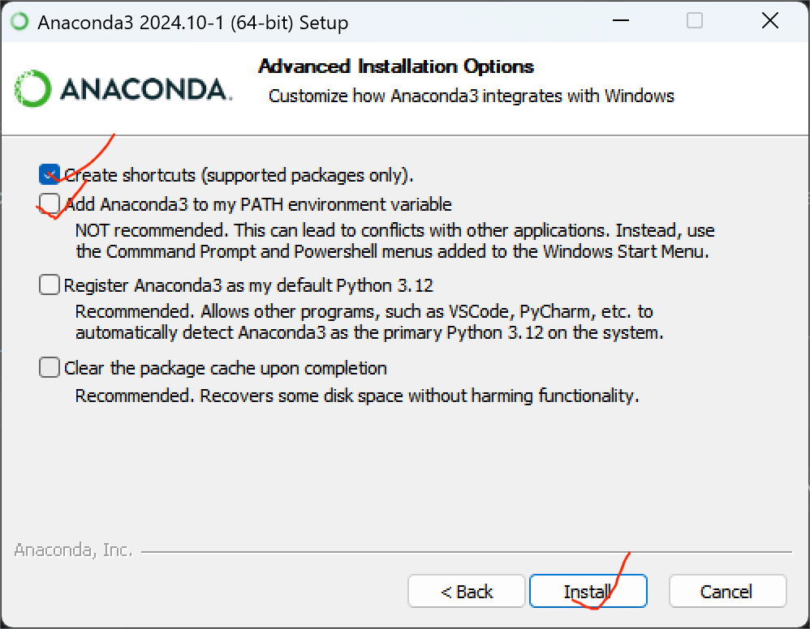
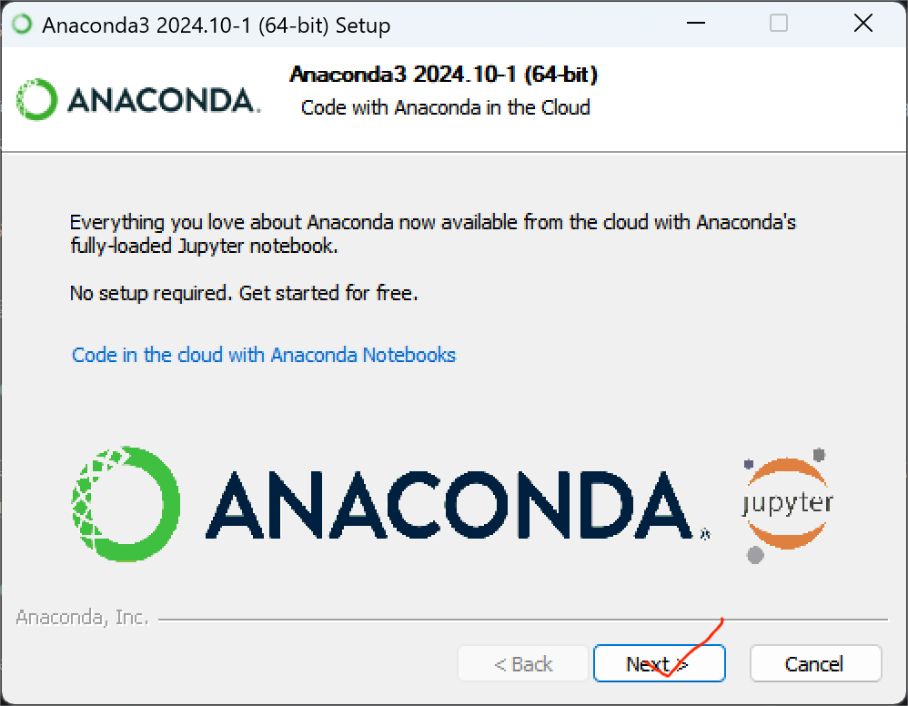

### 配置 Conda 环境

可以通过命令行或者 PyCharm 图形化界面配置 Conda 环境。

#### 命令行配置

运行下述指令创建 Conda 环境。
```
conda create --name <environment_name> python=<python_version>
```
其中 `<environment_name>` 填入环境名称, `<python_version>` 填入想要创建的 Python 版本。
例如
```
conda create --name conda_env python=3.12
```
然后运行指令激活 Conda 环境
```
conda activate <environment_name>
```
例如
```
conda activate conda_env
```

#### PyCharm配置

与虚拟环境相同， 只需要将虚拟环境的选项换成 Conda 环境即可。

### 依赖记录

在 Conda 环境中，我们通常使用 `environment.yml` 管理依赖。
在完成项目的软件包安装之后，我们可以执行下述命令导出配置。
```
conda env export > environment.yml
```
如果想要重新建立一个虚拟环境并且回复软件包安装的话，只需要运行
```
conda env create -f environment.yml
```
就可以了。
