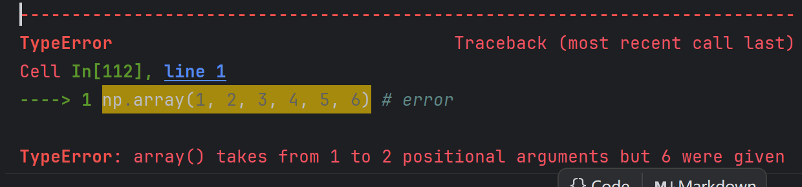

# Part 1. ndarray 快速入门

在本节中，我将介绍 `ndarray` 的入门知识。

**学习目标**


在完成这一节的学习之后，你将会掌握:

 - `ndarray` 的创建
 - `ndarray` 的轴和形状等属性
 - `ndarray` 打印与字符串转化
 - `ndarray` 的基本函数与运算
 - `ndarray` 的索引、切片和迭代器
 - `ndarray` 的引用、视图和拷贝
 - `ndarray` 的形状、分割与堆叠


```python
import numpy as np
```


## 课程视频

## `ndarray` 的创建

`ndarray`有多种创建方式，这里只介绍较为常用的几种。

### 通过数组类型转化

我们可以通过 `array()` 把其他数组类型(`array_like`)转化成 Numpy 中的数组，即 `ndarray`。
例如 Python 中的列表和元组，二者混合也是可以的。如果有多层的话，会将其转为高维数组。


```python
a = [[1, 2, 3], [4, 5, 6]]
b = (1, 2, 3, 4, 5, 6)
c = [(1, 2, 3), (4, 5, 6)]
```


```python
np.array(a)
```


    array([[1, 2, 3],
           [4, 5, 6]])


```python
np.array(b)
```


    array([1, 2, 3, 4, 5, 6])


```python
np.array(c)
```


    array([[1, 2, 3],
           [4, 5, 6]])


这里有一个常用的错误是，这里的参数必须传入单个数组或者矢量，而不能传入多个值。错误示例：


```python
# np.array(1, 2, 3, 4, 5, 6) # error
```



### 通过函数批量初始化

在有些情况下，我们在初始化的时候并不知道想要初始化的值，或者想要将其初始化为某些特定的值。
如果通过`for`循环遍历初始化显然有些太慢了，通过函数初始化则是一种更好的选择。


```python
np.zeros((3, 4))
```


    array([[0., 0., 0., 0.],
           [0., 0., 0., 0.],
           [0., 0., 0., 0.]])


```python
np.ones((2, 3))
```


    array([[1., 1., 1.],
           [1., 1., 1.]])


`np.zeros` 和 `np.ones` 用于将 `ndarray` 初始化为全`0`和全`1`数组，它接收一个一维元组表示各个维度数组的宽度，即数组在该维度下的元素数量。


```python
np.full((3, 4), 5)
```


    array([[5, 5, 5, 5],
           [5, 5, 5, 5],
           [5, 5, 5, 5]])


`np.full`用于将`ndarray`初始化为全是``fill_value` 的数组，它接收两个参数，分别为表示数组形状的元组和初始化的填充值`fill_value`。


```python
np.empty((1, 2))
```


    array([[0., 0.]])


`np.empty`用于只知道形状的数组的初始化，它创建的数组的值是未知的。


```python
np.arange(13)
```


    array([ 0,  1,  2,  3,  4,  5,  6,  7,  8,  9, 10, 11, 12])


`np.arange`类似于 Python 中的`range`，它可以生成一个数字序列作为一维数组。

## `ndarray`的属性

`ndarray` 是 NumPy 中的核心数据结构，它有多个属性用于描述数组的基本特征。以下是一些常见的属性：

- **`ndarray.ndim`**  
  返回数组的维度数。对于一维数组，返回 `1`；对于二维数组，返回 `2`，依此类推。

- **`ndarray.shape`**  
  返回数组的形状，即数组各维度的大小。对于一个二维数组，它是一个包含行数和列数的元组 `(rows, cols)`。

- **`ndarray.size`**  
  返回数组的总元素数，即所有维度大小的乘积。

- **`ndarray.dtype`**  
  返回数组的数据类型（`dtype`）。例如，可以是 `int32`、`float64` 等。

- **`ndarray.itemsize`**  
  返回数组中每个元素的字节大小。它是 `dtype` 对应的数据类型在内存中占用的字节数。

- **`ndarray.nbytes`**  
  返回数组占用的总字节数。它等于 `itemsize * size`。


```python
a = np.arange(24).reshape(2, 3, 4)
a
```


    array([[[ 0,  1,  2,  3],
            [ 4,  5,  6,  7],
            [ 8,  9, 10, 11]],
    
           [[12, 13, 14, 15],
            [16, 17, 18, 19],
            [20, 21, 22, 23]]])


```python
print("ndim:", a.ndim)
print("shape:", a.shape)
print("size:", a.size)
print("dtype:", a.dtype)
print("itemsize:", a.itemsize)
print("nbytes:", a.nbytes)
```

    ndim: 3
    shape: (2, 3, 4)
    size: 24
    dtype: int64
    itemsize: 8
    nbytes: 192
    

这些属性帮助我们了解和操作 NumPy 数组的基本特征和结构，是进行数据处理和分析时的重要工具。

## `ndarray`的打印与字符串转化

在 NumPy 中，`ndarray` 提供了多种方式进行打印和字符串转换，以便更好地展示数组的内容。

- **打印 `ndarray`**  
  使用 `print()` 函数可以直接打印 `ndarray` 对象。例如：


```python
print(a)
```

    [[[ 0  1  2  3]
      [ 4  5  6  7]
      [ 8  9 10 11]]
    
     [[12 13 14 15]
      [16 17 18 19]
      [20 21 22 23]]]
    


- **使用 `__str__` 或者 `__repr__`**


```python
print("str:", str(a))
print("repr:", repr(a))
```

    str: [[[ 0  1  2  3]
      [ 4  5  6  7]
      [ 8  9 10 11]]
    
     [[12 13 14 15]
      [16 17 18 19]
      [20 21 22 23]]]
    repr: array([[[ 0,  1,  2,  3],
            [ 4,  5,  6,  7],
            [ 8,  9, 10, 11]],
    
           [[12, 13, 14, 15],
            [16, 17, 18, 19],
            [20, 21, 22, 23]]])
    

## `ndarray` 的基本函数与运算

NumPy 提供了多种内置函数和运算，便于对 `ndarray` 进行基本操作。以下是一些常见的函数和运算。

#### 数组的基本运算

- **加法、减法、乘法、除法**  
  对 `ndarray` 进行数学运算非常简单，可以直接使用运算符进行加、减、乘、除等操作。


```python
arr1 = np.array([1, 2, 3])
arr2 = np.array([4, 5, 6])
print("+:", arr1 + arr2)  # 加法
print("-:", arr1 - arr2)  # 减法
print("*:", arr1 * arr2)  # 乘法
print("/:", arr1 / arr2)  # 除法
```

    +: [5 7 9]
    -: [-3 -3 -3]
    *: [ 4 10 18]
    /: [0.25 0.4  0.5 ]
    

- **点积（Dot product）**  
  使用 `np.dot()` 计算两个数组的点积，即对应元素相乘后求和。


```python
np.dot(arr1, arr2)
```


    np.int64(32)


- **矩阵乘法（Matrix multiplication）**  
  使用 `np.matmul()` 或 `@` 运算符进行矩阵乘法，适用于二维数组的乘法运算。


```python
arr1 = np.array([[1, 2], [3, 4]])
arr2 = np.array([[5, 6], [7, 8]])
np.matmul(arr1, arr2)  # 或者 arr1 @ arr2
```


    array([[19, 22],
           [43, 50]])


#### 数组的基本函数

- **`np.sum()`**  
  计算数组元素的总和。


```python
arr = np.array([1, 2, 3, 4])
np.sum(arr)
```


    np.int64(10)


- **`np.mean()`**  
  计算数组元素的均值。


```python
np.mean(arr)
```


    np.float64(2.5)


- **`np.std()`**  
  计算数组的标准差，衡量数组元素的分布情况。


```python
np.std(arr)
```


    np.float64(1.118033988749895)


- **`np.min()` 和 `np.max()`**  
  计算数组中的最小值和最大值。


```python
print("min:", np.min(arr))
print("max:", np.max(arr))
```

    min: 1
    max: 4
    

- **`np.argmin()` 和 `np.argmax()`**  
  返回数组中最小值和最大值的索引。


```python
print("argmin:", np.argmin(arr))
print("argmax:", np.argmax(arr))
```

    argmin: 0
    argmax: 3
    

- **`np.reshape()`**  
  改变数组的形状，适用于调整数组的维度。


```python
arr = np.array([1, 2, 3, 4])
arr.reshape((2, 2))
```


    array([[1, 2],
           [3, 4]])


- **`np.transpose()`**  
  转置数组，主要用于二维数组，将行列交换。或者使用`ndarray.T`也可以达到同样的效果。


```python
arr = np.array([[1, 2], [3, 4]])
print("np.transpose:\n", np.transpose(arr))
print("ndarray.T:\n", arr.T)
```

    np.transpose:
     [[1 3]
     [2 4]]
    ndarray.T:
     [[1 3]
     [2 4]]
    

#### 数组的逻辑运算

- **`np.all()` 和 `np.any()`**  
  检查数组中是否所有元素为 `True` 或是否至少有一个元素为 `True`。


```python
arr = np.array([True, False, True])
print(np.all(arr))  # 输出 False
print(np.any(arr))  # 输出 True
```

    False
    True
    

- **元素级的比较运算**  
  可以直接对数组进行元素级的比较运算，如相等、大于、小于等。


```python
arr1 = np.array([1, 2, 3])
arr2 = np.array([3, 2, 1])
print(arr1 == arr2)  # 输出 [False  True False]
print(arr1 > arr2)   # 输出 [False False  True]
```

    [False  True False]
    [False False  True]
    

通过这些基本的运算和函数，你可以高效地对 `ndarray` 进行各种数学和逻辑操作，进而进行复杂的数据分析和处理。

## `ndarray` 的索引、切片和迭代器

### 一维数组
一维数组可以被索引、切片和迭代，就像 `list` 和其他 Python 序列一样。


```python
a = np.arange(12)
a
```


    array([ 0,  1,  2,  3,  4,  5,  6,  7,  8,  9, 10, 11])


```python
a[2]
```


    np.int64(2)


```python
a[2:6]
```


    array([2, 3, 4, 5])


```python
a[2:6] = 100
a
```


    array([  0,   1, 100, 100, 100, 100,   6,   7,   8,   9,  10,  11])


```python
for i in a:
    print(i + 25, end=" ")
a
```

    25 26 125 125 125 125 31 32 33 34 35 36 


    array([  0,   1, 100, 100, 100, 100,   6,   7,   8,   9,  10,  11])


其中我们也可以通过输入相同形状的bool数组进行切片。


```python
a[a % 2 == 0]
```


    array([  0, 100, 100, 100, 100,   6,   8,  10])


### 多维数组
多维数组的每个轴有一个索引，这些索引以元组的形式给出。


```python
a = np.arange(12).reshape(3, 4)
a
```


    array([[ 0,  1,  2,  3],
           [ 4,  5,  6,  7],
           [ 8,  9, 10, 11]])


```python
a[2, 3]
```


    np.int64(11)


```python
a[:, 1]
```


    array([1, 5, 9])


当提供的索引维数小于数组的维数时，缺失的索引将被视为完整切片`:`。


```python
a[1]
```


    array([4, 5, 6, 7])


对于多维数组的迭代，是针对第一个轴进行的。


```python
for i in a:
    print(repr(i))
```

    array([0, 1, 2, 3])
    array([4, 5, 6, 7])
    array([ 8,  9, 10, 11])
    

 如果想要针对单个元素进行迭代，可以将数组展平为一维数组之后进行。


```python
for i in a.flat:
    print(i, end=" ")
print("\n")
```

    0 1 2 3 4 5 6 7 8 9 10 11 
    
    

## `ndarray` 的引用、视图和拷贝

### `ndarray` 的引用
简单的赋值并不会复制对象。


```python
a = np.array(1)
b = a
b is a
```


    True


Python 将可变对象作为引用传递，因此函数调用也不会发生复制。


```python
def f(arr):
    return arr is a
f(a)
```


    True


### `ndarray` 的视图

不同的数组对象可以共享相同的数据，这种共享中可以称不持有数据的数组为对应持有数据的数组的视图。
我们可以通过`ndarray.view()`查看一个数组的视图。


```python
a = np.array([1, 2, 3])
b = a.view()
b
```


    array([1, 2, 3])


这里视图数组并不是原数组的引用，但是他们查看的是相同的数据，视图数组的`base`属性存储了原数组的引用。


```python
print("b is a:", b is a)
print("b.base is a:", b.base is a)
```

    b is a: False
    b.base is a: True
    

视图数组的视图数组中，其存储的原数组`base`存储了原数组（即持有数据的数组）的引用，而不是创建视图数组的引用。


```python
c = b.view()
print("c is b:", c is b)
print("c.base is b:", c.base is b)
print("c.base is a:", c.base is a)
```

    c is b: False
    c.base is b: False
    c.base is a: True
    

视图中的数组数据更改，原数组中的数据也会被更改。（他们更改的是同一份数据）


```python
b[2] = 100
a
```


    array([  1,   2, 100])


数组的索引、切片创建的也是数组的视图而并非拷贝，一些方法(例如`ndarray.reshape()`)返回的也是数组的视图。


```python
b = a[1:2]
b
```


    array([2])


```python
print("b is a:", b is a)
print("b.base is a:", b.base is a)
print("b.flags.owndata:", b.flags.owndata)
```

    b is a: False
    b.base is a: True
    b.flags.owndata: False
    


```python
b = a.reshape(1, 3)
b
```


    array([[  1,   2, 100]])


```python
print("b.shape:", b.shape)
print("a.shape:", a.shape)
print("b.base is a:", b.base is a)
```

    b.shape: (1, 3)
    a.shape: (3,)
    b.base is a: True
    

### `ndarray` 的拷贝
我们可以通过`copy`方法对数组进行深拷贝。


```python
a = np.array([1, 2, 3])
b = a.copy()
b
```


    array([1, 2, 3])


```python
print("b is a:", b is a)
print("b.base is a:", b.base is a)
print("b.flags.owndata:", b.flags.owndata)
```

    b is a: False
    b.base is a: False
    b.flags.owndata: True
    

此时他们二者持有的是相互独立的数据。

**注意:** Numpy 的 MaskedArray 在拷贝方面有众多bug，不建议使用。（其实它哪个方面都有众多bug）

## `ndarray` 的形状、分割与堆叠

我们通常将 `ndarray.shape` 的返回值称作 `ndarray` 的形状，对于一个 n 维的数组，其形状为一个 n 个元素的元组，其中第 i 个元素表示该数组在第 i 维的宽度。


```python
arr = np.arange(12).reshape(3, 4)
arr
```


    array([[ 0,  1,  2,  3],
           [ 4,  5,  6,  7],
           [ 8,  9, 10, 11]])


### `ndarray` 的形状的操作

我们可以通过`ndarray.shape`获取`ndarray`的形状，并且有多种改变其形状的操作。


```python
arr.shape
```


    (3, 4)


#### 不改变原数组的操作

**`ndarray.reshape`**

我们可以通过`ndarray.reshape`返回当前数组在某个形状下的视图，而不改变原数组的顺序，他们共享一份数据。


```python
arr1 = arr.reshape(2, 6)
arr1
```


    array([[ 0,  1,  2,  3,  4,  5],
           [ 6,  7,  8,  9, 10, 11]])


```python
arr
```


    array([[ 0,  1,  2,  3],
           [ 4,  5,  6,  7],
           [ 8,  9, 10, 11]])


```python
print("arr.shape:", arr.shape)
print("arr1.shape:", arr1.shape)
print("arr1.flags.owndata:", arr1.flags.owndata)
```

    arr.shape: (3, 4)
    arr1.shape: (2, 6)
    arr1.flags.owndata: False
    


```python
arr[1,2] = 1000
arr1
```


    array([[   0,    1,    2,    3,    4,    5],
           [1000,    7,    8,    9,   10,   11]])


**`ndarray.ravel`**

`ndarray.ravel` 可以将数组展平为一维数组，其中的默认顺序按照C数组的顺序，也就是越靠后的索引变化越快。`ndarray.ravel`返回的是视图，也就是说其与原数组共享一份数据。


```python
arr = np.arange(12).reshape(3, 4)
arr1 = arr.ravel()
arr1
```


    array([ 0,  1,  2,  3,  4,  5,  6,  7,  8,  9, 10, 11])


```python
arr1.flags.owndata
```


    False


**`ndarray.T`**
对于二维数组，`ndarray.T`可以返回其转置的视图，其与原数组共享一份数据。


```python
arr = np.arange(12).reshape(3, 4)
arr1 = arr.T
arr1
```


    array([[ 0,  4,  8],
           [ 1,  5,  9],
           [ 2,  6, 10],
           [ 3,  7, 11]])


```python
arr1.flags.owndata
```


    False


#### 改变原数组的操作

**`ndarray.resize`**

我们可以通过 `ndarray.resize` 改变当前数组的形状。


```python
arr = np.arange(12).reshape(3, 4)
arr.resize(2, 6)
arr
```


    array([[ 0,  1,  2,  3,  4,  5],
           [ 6,  7,  8,  9, 10, 11]])


### `ndarray` 的分割

我们可以通过`np.array_split`将数组沿某个轴分割为几个部分。他需要输入三个参数，分别为要分割的数组、分割的位置和分割的坐标轴。


```python
arr = np.arange(12).reshape(3, 4)
result = np.array_split(arr, 2, axis=1)
result
```


    [array([[0, 1],
            [4, 5],
            [8, 9]]),
     array([[ 2,  3],
            [ 6,  7],
            [10, 11]])]


```python
arr = np.arange(12).reshape(3, 4)
result = np.array_split(arr, 2, axis=0)
result
```


    [array([[0, 1, 2, 3],
            [4, 5, 6, 7]]),
     array([[ 8,  9, 10, 11]])]


默认的分割并不会发生数据拷贝，分割后的数组并不拥有数据，他们持有相同的一份数据。


```python
result[0].flags.owndata
```


    False


```python
result[0][1,2] = 1000
arr
```


    array([[   0,    1,    2,    3],
           [   4,    5, 1000,    7],
           [   8,    9,   10,   11]])


### `ndarray`的堆叠

我们可以通过`np.concatenate`进行数组的堆叠，他与原数组持有不同的数据，相当于执行了拷贝。它需要输入两个参数，分别是堆叠的参数列表和堆叠的坐标轴。这里需要注意的是，除了堆叠的坐标轴外其余坐标轴形状要求相等，这里不考虑“广播”特性。


```python
arr1 = np.arange(12).reshape(3, 4)
arr2 = arr1.copy()
arr = np.concatenate((arr1, arr2), axis=1)
arr
```


    array([[ 0,  1,  2,  3,  0,  1,  2,  3],
           [ 4,  5,  6,  7,  4,  5,  6,  7],
           [ 8,  9, 10, 11,  8,  9, 10, 11]])


```python
arr = np.concatenate((arr1, arr2), axis=0)
arr
```


    array([[ 0,  1,  2,  3],
           [ 4,  5,  6,  7],
           [ 8,  9, 10, 11],
           [ 0,  1,  2,  3],
           [ 4,  5,  6,  7],
           [ 8,  9, 10, 11]])


```python
arr[1,2] = 1000
arr1
```


    array([[ 0,  1,  2,  3],
           [ 4,  5,  6,  7],
           [ 8,  9, 10, 11]])


```python
print("arr.flags.owndata:", arr.flags.owndata)
```

    arr.flags.owndata: True
    
