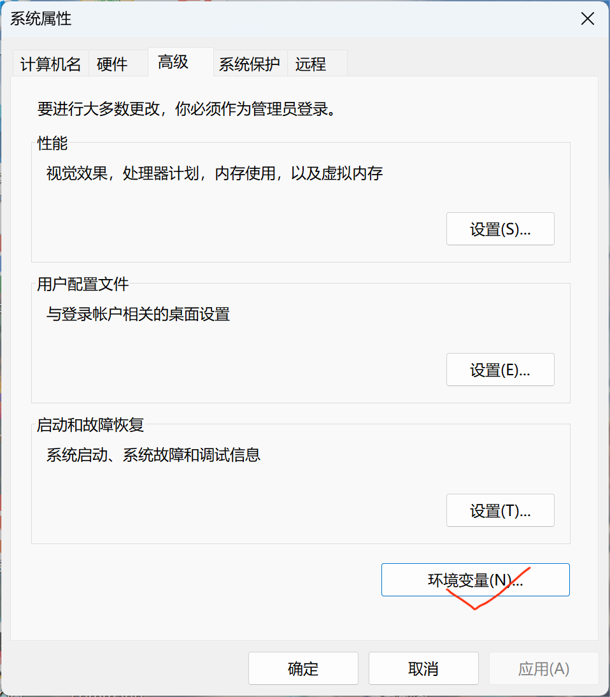

# Part 1. Python 的选择与安装

在这一节中,我将主要讲述如何安装 Python 和 IDE 。

## 课程视频

## 安装 Python

请确认你的电脑系统，对于不同的系统，需要安装不同的 Python 版本。
这里主要是确认是(Windows/Linux/MacOS)中的哪一个就可以了，对于Windows还需要注意是否支持64位系统。
由于我只有Windows设备，这里就只演示Windows下的操作，其他系统类似。
如果遇到问题，可以去B站搜索专门的辅导视频:
 - [Linux](https://www.bilibili.com/video/BV1Lz411b7G3?vd_source=4b8f686368bbdecc379df7af1e16847a)
 - [MacOS](https://www.bilibili.com/video/BV1jr4y1y7hc?vd_source=4b8f686368bbdecc379df7af1e16847a)

首先，我们先打开[Python 官网](https://www.python.org/),
进入到[下载界面](https://www.python.org/downloads/windows/)，
选择一个合适的版本，然后就可以下载了。我制作这个教程时使用的是 Python 3.12.7，
如果和我一样是 Windows 64位系统的同学们就可以直接点击
[这里](https://www.python.org/ftp/python/3.12.7/python-3.12.7-amd64.exe)直接下载。

我个人建议使用 Python 3.12.7 版本，现在 Python 3.13.0 刚出， Python 3.14 的前瞻刚出，比较不稳定。
而较早的版本中Numpy则可能出现一些变化，
最明显的一个例子就是在Python 3.12 及以后的版本中 Numpy 的 `distutils` 包被弃用。

在下载完成之后，运行下载的exe (如果下载的是源代码的话请参考从源码编译)。


勾选 `Add * to PATH`选项，如果是第一次安装Python的话，然后点击默认安装。
等待安装结束，在出现结束界面后关闭安装程序（可以删除安装程序）。




打开系统环境变量，查看对应的PATH (这里取决于是当前用户安装还是所有用户安装)，检查是否存在对应Python版本的路径。
若前面忘记勾选 `Add * to PATH`选项，可以在这里手动添加。

打开命令提示符或者PowerShell或者其他系统对应的可以执行命令的工具，输入
```
python
```
得到以下输出，说明安装成功:
```
PS C:\Users\Eden_> python
Python 3.12.7 (tags/v3.12.7:0b05ead, Oct  1 2024, 03:06:41) [MSC v.1941 64 bit (AMD64)] on win32
Type "help", "copyright", "credits" or "license" for more information.
>>> 
```
对于安装了多个 Python 版本的电脑，如果安装了Python的启动器Py，可以使用命令`py -x.x(你的目标版本)`,例如`py -3.12`。

## 安装IDE

在开发过程中,一个好的 IDE 往往可以让你事半功倍。我这里推荐大家使用的是 Jetbrains 的 PyCharm 作为 Python 的 IDE,
我已经用了快两年了,它的 Community 版本是免费的(绝大多数需要的功能都有),真的很好用。
当然了,如果使用的是线上编译器的话,就不需要考虑这个问题了。

[Windows 安装](https://www.jetbrains.com/zh-cn/pycharm/download/download-thanks.html?platform=windows&code=PCC)

其他系统请自行安装。安装软件应该不用我来教吧awa。
